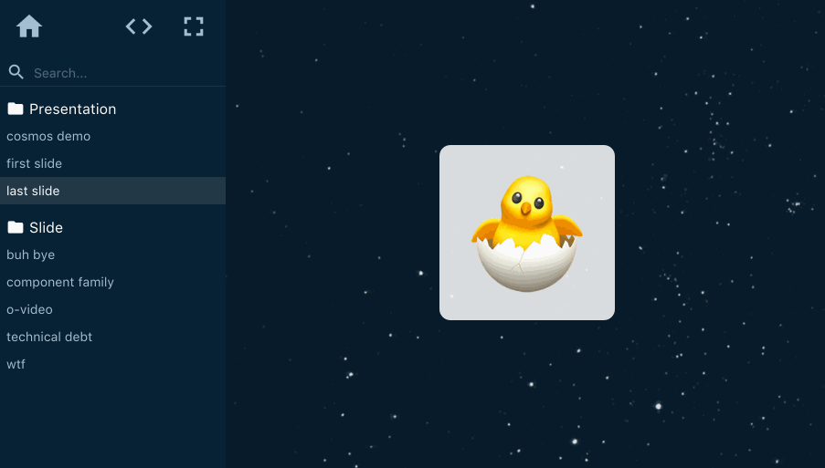

# UI development made simple

My JSHeroes talk on how to build a scalable UI architecture (powered by [React Cosmos](https://github.com/react-cosmos/react-cosmos))


```bash
npm i
npm start
# or
yarn
yarn start
```


